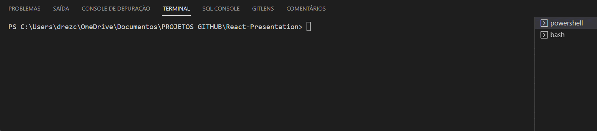
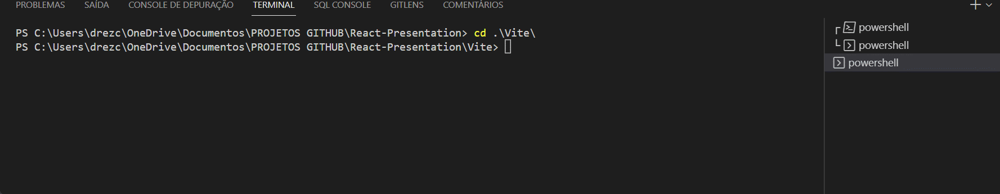

# <h1 style="font-size:2em; text-align:center">React-Study-Presentation</h1>


</img>

<!---->

<h1 style="color:rgb(43, 193, 242);font-size:2em; text-align: center">React vs React Native</h1>

<div style="margin-left: auto;
            margin-right: auto;
            color:rgb(43, 193, 242)"
            >

|Descrição  | React| React Native|
|:-----:    |:-----:|:-----------:|
|Criado Por |  Jordan Walke, Facebook  |    Facebook     |
|Ano        | 2012  | 2015  |
|Baseado em | JavaScript | JavaScript |
|Foco | Web  |     Mobile    |

</div>

### Empresas que usam a tecnologia:
* Facebook
* Instagram
* Netflix
* Skype
* Tesla
* Wix
* Discord
* Walmart


React e React Native são duas tecnologias usadas para desenvolver aplicações web e mobile ambas são baseadas em JavaScript e são conhecidas por serem usadas para contruir interfaces de usuario - (UI - user interface) 

O que é:

***React:***  É uma biblioteca JavaScript usada para construir interface de usuários em aplicações web. O React pode ser facilmente integrado com o codigo existente ou com outras bibliotecas.

- Objetivo principal: Simplificar o desenvolvimento e criação de aplicações web que são rápidos, escaláveis e simples.

***React Native:*** É o irmão mais novo do React porém criado para mas foi projetado para criar aplicativos móveis nativos com componentes reutilizáveis. Permitindo criar aplicativos móveis multiplataforma. Antes do React Native os desenvolvedores precisavam usar varios tipos de ferramentas para desenvolver para plataformas diferentes.

- Objetivo principal: Com o React Native é possivel desenvolver um aplicativo multiplataforma e que rode em varias plataformas(Windows, Android, iOS) de forma fácil.

***Frases:*** 

"Learn once, write anywhere."
Aprenda uma vez, escreva em qualquer lugar.

“Write once, run anywhere”
Escreva uma única vez e rode em qualquer lugar 


### Exemplo Prático:

[Construindo a interface fake](https://github.com/Ratkovski/React-app-bank)


Como iniciar um projeto React Native: 
Ter instalado :
 - Node
 - npm  -  ou outro gerenciador de pacote

 Da para instalar direto como na documentação, assim  como outras formas como com o expo e o vite que facilitam a parte de configuração etc...

>>> Na minha opnião pessoal e de quem esta aprendendo ainda, o vite é utilizado para quando o foco é o desenvolvimento de aplicações web e o Expo quando o foco é  aplicativos

Instalando com o expo : [Expo](https://docs.expo.dev/)
```
npx create-expo-app Demo-Expo
```
```
cd Demo-Expo
```
```
npx expo install react-dom react-native-web @expo/webpack-config
```
```
npx expo start
```



Instalando com o vite : Vite](https://vitejs.dev/)

```
npm create vite@latest
```
```
cd my-project
```
```
npm install
```
```
npm run dev
```



### Lições Aprendidas

:white_check_mark: Planejar antes de começar (escrever/desenhar).

:white_check_mark: Levante todos os requisitos e funcionalidades.

:white_check_mark:Mais importante documente o que a aplicação ***não*** vai fazer.

:white_check_mark: Crie padrões.

:white_check_mark: Crie algo que possa ser reutilizado facilmente.

:white_check_mark: Documente o que você desenvolveu.


### Fontes de estudo:
- Rocketseat [***Link Rocketseat***](https://www.rocketseat.com.br/)
    - Cursos  (free/pago)
    - Bootcamps
    
- Dio Digital Innovation One [***Link Dio***](https://www.dio.me/en/sign-in)
    - Cursos (free/pagos)
    - Bootcamps (free/pagos)
    - Inglês (direcionado para a área de TI)


### Examples:
[React.js and Spring Data REST](https://spring.io/guides/tutorials/react-and-spring-data-rest/) 

[Building Realtime Multiplayer](https://blog.simonireilly.com/posts/building-games-with-react-01)


### References:
[React vs React Native: Which One to Choose and Why?](https://radixweb.com/blog/react-vs-react-native)

[React vs React Native: What’s the difference?](https://devskiller.com/react-vs-react-native-whats-the-difference/)

[React Docs](https://reactjs.org/)

[React Native Docs](https://reactnative.dev/)
